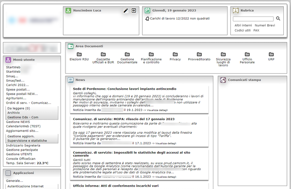

```{r setup, include=FALSE}
knitr::opts_chunk$set(echo = TRUE)
```
## Corso di Fondamenti di Scienza dei Dati e Laboratorio
### AA 2021 - 2022


## Introduzione

L'obiettivo del progetto è di analizzare i dati relativi alla navigazione delle pagine web di una intranet aziendale.


## Specifiche del dominio

### Contesto

Nel 2018 le Camere di Commercio di Pordenone e Udine si accorpano e viene costituito un unico Ente con due sedi nei rispettivi capoluoghi (Pordenone e Udine)\
Il processo di accorpamento è complesso e, tra i vari aspetti, comprende anche la convergenza dei sistemi informativi.\
Tale processo è tuttora in corso e viene gestito per step successivi, razionalizzando le risorse umane, economiche e tecnologiche disponibili.\
\
Tra gli asset tecnologici oggetto di integrazione ci sono le rispettive piattaforme per gestire i processi di comunicazione interna e la digitalizzazione di alcune attività originariamente gestite manualmente e/o supporto cartaceo.\
Presso la sede di Pordenone dal 2004 è in uso una intranet _web-based_ programmata in PHP su piattaforma Microsoft IIS e Microsoft SQL Server, mentre presso la sede di Udine le analoghe funzioni sono state sviluppate su architettura client - server su piattaforme Lotus Domino e FileMaker.\
\
Dopo opportune valutazioni di carattere economico e gestionale, nel 2019 si è optato per estendere alla sede di Udine l'utilizzo della intranet in uso a Pordenone e pianificando il porting su piattaforma _web-based_ delle applicazioni Lotus e FileMaker.\
\
Il primo step di questo processo ha comportato un _refactoring_ della piattaforma per migliorare alcuni aspetti di sicurezza ed un restyling estetico/funzionale per migliorare la User Experience.\
\
*Vecchia versione del portale*

\
\
*Nuova versione del portale*

\
\

### Origine e descrizione del _dataset_

Contestualmente alle operazione di _refactoring_, è stata inserita una porzione di codice per registrare nel DataBase i dati di navigazione degli utenti.
Nello specifico, per ogni pagina richiesta al server vengono registrate le seguenti informazioni nella tabella *home_stats* del database:

* *id* - Identificativo univoco del record
* *session_id* - Session ID della [sessione PHP](https://www.php.net/manual/en/book.session.php)
* *ipaddress* - Indirizzo IP del client
* *userid* - Eventuale UserID (presente se la pagina è richieste dopo aver effettuato il login aul portale)
* *req_method* - [Metodo HTTP utilizzato](https://www.rfc-editor.org/rfc/rfc7231#section-4)
* *req_uri* - [URI della pagina richiesta](https://www.rfc-editor.org/rfc/rfc7230#section-5.3)
* *exec_time* - Tempo di esecuzione dello script, in secondi (sfruttando la [funzione PHP microtime()](https://www.php.net/manual/en/function.microtime.php))
* *user_agent* - Stringa contenente lo [user-agent](https://www.rfc-editor.org/rfc/rfc7231#section-5.5.3)
* *ux_time* - Timestamp della richiesta (ottenuta tramite la [funzione PHP time()](https://www.php.net/manual/en/function.time.php))
\

Dal database viene anche mutuata parte della tabella *home_users* che contiene dati relativi agli utenti, in particolare la sede di assegnazione e il suo status (abilitato o meno):

* *userid* - User ID dell'utente
* *id_sede* - Sede di assegnazione dell'utente
* *abilitato* - Booleano per lo status dell'utente
\
\

### Obiettivi dell'analisi

L'obiettivo è di indagare il _data set_ relativamente ai seguenti aspetti:

* **Analisi delle richieste in funzione della sede**
  + _Come sono distribite le richieste per ciascuna sede?_
  + _Come è evoluto nel tempo il numero di richieste per ciascuna sede?_
  + _Com'è l'andamento intraday delle richieste?_
\
* **Analisi del tipo di browser utilizzato**
  + _Quali sono i browser utilizzati dagli utenti?_
  + _C'è differenza tra le sedi?_
\
* **Analisi delle applicazioni (moduli della intranet) utilizzate**
  + _Quali sono le applicazioni maggiormente utilizzate?_
\
* **Tempo di generazione delle pagine**
  + _Qual'è il tempo medio di esecuzione degli script PHP?_
  + _Il tempo di esecuzione degli script è influenzato dall'applicazione?_
  + _Il tempo di esecuzione degli script è influenzato dalla fascia oraria?_
\
* **Analisi dell'utilizzo della rubrica**
  + Quali sono le parole più ricercate?


### Setup dell'ambiente di sviluppo

**Packages installati**

* **RODBC**
  + Interfaccia database ODBC
  
* **Tidyverse**
  + tidyr
  + dplyr
  + lubridate
  + stringr
  + ggplot2

```{r warning=FALSE, include=FALSE}
#Package RODBC
library(RODBC)
#Package Tidyverse
library(tidyr) 
library(dplyr) 
library(lubridate) 
library(stringr) 
library(ggplot2)
```


### Importazione dati da sorgente ODBC

I dati sono estratti dal DB MS SQL Server aziendale.
L'accesso viene fatto tramite driver ODBC e dati vengono salvati su file csv per il successivo riutilizzo in ambiente extra-aziendale.
(Il codice è commentato per evitare l'esecuzione in ambiente extra aziendale)

```{r}
# webdb = odbcConnect("webdb64", uid="webdb", pwd="webdb")
# 
# # I dati degli utenti vengono estratti escludendo dati di sicurezza (hash delle password)
# users = sqlQuery (webdb, "select userid, id_sede, abilitato from home_users;")
# 
# # Tabella richieste
# richieste = sqlFetch(webdb, "home_stats")
# 
# # Salvataggio su CSV
# write.csv(users, "users.csv")
# write.csv(richieste, "richieste.csv")
# 
# close(webdb)
```

Caricamento del data set da csv (per utilizzo extra aziendale, o con DB inaccessibile)
```{r}
users = read.csv("users.csv")
richieste = read.csv("richieste.csv")
```


### Sistemazione della tabella delle richieste

**Data e orario** della richiesta sono salvate in formato *Unix Timestamp* (tempo da Unix Epoch, in secondi).\
Si trasforma il campo **ux_time** in **oggetto dataora**, rimuovendo il campo originale.

```{r}
richieste = richieste %>%
  mutate (dataora = as_datetime(ux_time)) %>%
  select (-ux_time)
```

\
Il campo **req_method** identifica il metodo utilizzato per la  HTTP-request.\
Per come è implementata la rilevazione, dovrebbero esserci solo richieste di tipo **GET**

```{r}
richieste %>%
  count (req_method) %>%
  group_by(req_method)
```

Si trovano invece alcune richieste di tipo **OPTIONS** e **PROPFIND**, verosimilmente generate da *BOT* o *Web Crawler*.\
Decido di filtrare questo tipo di richieste in quanto non significative ai fini della rilevazione.\
Si procede inoltre ad eliminare il campo **req_method** in quanto non più significativo.\

```{r}
richieste = richieste %>%
  filter (req_method == "GET") %>%
  select (-req_method)
```
\
Il codice per la registrazione delle richieste è stato implementato nel corso del mese di aprile 2021, quindi il primo mese completo di rilevazione è **maggio 2021**.\
Si procede quindi a filtrare i dati del periodo **dal 01.05.2021 al 31.12.2022**, ultimo mese completo disponibile al momento dell'analisi.\
Vengono escluse anche le pagine richieste dagli host aventi IP address 10.22.6.143 e 10.29.5.172, in quanto corrispondeno a postazioni di sviluppo, test e security audit, e che quindi generano numerose richieste non significative.\

```{r}
richieste = richieste %>%
  filter (dataora >= "2021-05-01", dataora<='2022-12-31', ipaddress != "10.22.6.143", ipaddress != "10.29.5.172")
```
\
Risulterà utile distinguere le richieste provenienti dalla sede di Udine da quelle provenienti dalla sede di Pordenone.\
Per fare questo si sfrutta il fatto che le due sedi utilizzano due subnet diverse:
* 10.29.x.x identifica il traffico proveniente dalla sede di Udine
* 10.22.x.x identifica il traffico provenientedella sede di Pordenone)
Le richieste provenienti da indirizzi IP non appartenenti a queste subnet si riferiscono a client operanti al di fuori di queste due sedi (tipicamente client da VPN), e non sono quindi riconducibili a nessina delle due sedi.


```{r}
richieste = richieste %>%
  mutate (sede = case_when(
    str_detect(ipaddress,"10.29.") ~ "UD",
    str_detect(ipaddress,"10.22.") ~ "PN",
    TRUE ~ "Other"))
```


### Analisi delle richieste in funzione della sede

  **+ _Come sono distribite le richieste per ciascuna sede?_**

```{r}
richieste_per_sede = richieste %>% 
  group_by(sede) %>% 
  summarise(n=n()) %>%
  arrange (desc(n)) %>%
  mutate (distribuzione = "Richieste", perc = n / sum(n))
richieste_per_sede
```

Le richieste provenienti da subnet diverse da quelle delle sedi sono trascurabili e non verranno ulteriormente indagate.
```{r}
richieste = richieste %>% filter (sede != "Other")
```


**Numero utenti per sede**

Per valutare correttamente la portata del numero di richieste proveniento dalle sedi, si procede con la verifica della distribuzione degli utenti per sede. (Nel database di riferimento la sede di PN è identificata con id_sede = 1, la sede di Udine è identificata con id_sede = 2)

```{r}

users = users %>% 
  filter (abilitato == 1) %>%
  mutate (sede = case_when(
    id_sede==2 ~ "UD", 
    id_sede==1 ~ "PN"))

utenti_per_sede = users %>%
  group_by(sede) %>%
  summarise(n=n()) %>%
  mutate (distribuzione = "Utenti", perc = n/sum(n))

utenti_per_sede
```

**Come sono distribuite le richieste per ciascuna sede?**\

```{r}
glob = rbind(utenti_per_sede, richieste_per_sede)

ggplot(glob, aes(x=sede, y=perc, fill=distribuzione)) +
    geom_bar(stat='identity', position='dodge') + 
    labs(title="Distribuzione utenti e richieste, per sede", x="Sede", y = "distribuzione")
    
```
Il boxplot evidenzia che la sede di Udine è ancora in una fase iniziale di adozione dello strumento, con notevoli margini di crescita. Occorre infatti considerare che la sede di Udine impiega circa due terzi dei dipendenti


  
  
  
  + _Come è evoluto nel tempo il numero di richieste per ciascuna sede?_
  + _Com'è l'andamento intraday delle richieste_
    
**Come è evoluto nel tempo l'utilizzo della intranet?**\

Richieste per mese / sede

```{r}
mensili = richieste %>%
  group_by(mese = floor_date(dataora, unit = "month"), sede) %>%
  summarise(n=n())

```

Distribuzione delle richieste mensili, per sede

```{r}
ggplot (mensili, aes(sede, n, color=sede)) +
  geom_boxplot() +
  labs(title="Numero mensile di pagine richieste, per sede", x="Sede", y = "# richieste")

```

**Andamento temporale**

```{r}
mensiliPN = mensili %>%
  filter (sede=="PN")
mensiliUD = mensili %>%
  filter (sede=="UD")

modPN = lm(n~mese, data=mensiliPN)
modUD = lm(n~mese, data=mensiliUD)

ggplot(mensili, aes(mese, n, color=sede)) +
  geom_point(size=2) +
  geom_abline(intercept = modPN$coefficients[1], 
              slope = modPN$coefficients[2], 
              color = "red", linewidth = 1.5) + 
    geom_abline(intercept = modUD$coefficients[1], 
              slope = modUD$coefficients[2], 
              color = "green", linewidth = 1.5)
```
L'analisi mostra che ...


## Analisi User Agent

**Quali browser sono utilizzati?**

Il browser può essere identificato ispezionando la stringa **user_agent**

[RFC 7231 - Sezione 5.5.3](https://www.rfc-editor.org/rfc/rfc7231#section-5.5.3)
[Articolo su developer.mozilla.org](https://developer.mozilla.org/en-US/docs/Web/HTTP/Browser_detection_using_the_user_agent)


```{r}

richieste = richieste %>% mutate (browser = "Other")

richieste = richieste %>%
  mutate(browser = case_when(
    str_detect(user_agent, "Firefox\\/\\d*") ~ "Firefox",
    str_detect(user_agent, "; MSIE \\d*") ~ "IE10",
    str_detect(user_agent, "Trident\\/7.0; .*rv:\\d*") ~ "IE11",
    str_detect(user_agent, "Edg/") ~ "Edge",
    str_detect(user_agent, "Chrome/") ~ "Chrome",
    TRUE ~ "Other"
  ))

browser = richieste %>% group_by(browser, sede) %>% count() %>%
  mutate (perc = n / nrow(richieste))

ggplot(richieste) +
  geom_bar(aes(browser, fill = browser))

ggplot(richieste) +
  geom_bar(aes(browser, fill = browser)) +
  facet_wrap("sede")

```
```{r}

mensiliIE = richieste %>% filter (str_detect(browser, "IE")) %>%
  group_by(mese = floor_date(dataora, unit = "month"), sede) %>%
  summarise(n=n())

mensiliPNIE = mensiliIE %>%
  filter (sede=="PN")
mensiliUDIE = mensiliIE %>%
  filter (sede=="UD")

modPNIE = lm(n~mese, data=mensiliPNIE)
modUDIE = lm(n~mese, data=mensiliUDIE)

ggplot(mensiliIE, aes(mese, n, color=sede)) +
  geom_point(size=3) +
  geom_abline(intercept = modPNIE$coefficients[1], 
              slope = modPNIE$coefficients[2], 
              color = "red", linewidth = 1.5) + 
    geom_abline(intercept = modUDIE$coefficients[1], 
              slope = modUDIE$coefficients[2], 
              color = "green", linewidth = 1.5) +
  labs(title="Numero mensile di pagine richieste da browser IE (10 e 11), per sede", x="Sede", y = "# richieste")

```


## Analisi applicazione
**Quali sono le applicazioni più utilizzate?**\
**(SUB) Quali sono le parole più ricercate in rubrica?**\

```{r}

richieste = richieste %>%
  mutate (application = case_when(
    req_uri=="/" ~ "Homepage",
    req_uri=="/default.php" ~ "Homepage",
    str_detect(req_uri, "rubrica") ~ "Rubrica",
    str_detect(req_uri, "odscom*") ~ "OdsCom",
    str_detect(req_uri, "pagina=documenti") ~ "Documenti",
    str_detect(req_uri, "error") ~ "Error",
    str_detect(req_uri, "gestionenews|news*") ~ "News",
    str_detect(req_uri, "userprofile|usermanage") ~ "UserProfile",
    TRUE ~ "Other")
  )

richieste %>%
  group_by(application) %>%
  summarise(n=n()) %>%
  arrange (desc(n))

ggplot(richieste %>% filter (application!="Homepage")) +
  geom_bar(aes(application, fill=application)) + 
  facet_wrap("sede")

```


```{r}
mensiliDoc = richieste %>% filter (application == "Documenti") %>%
  group_by(mese = floor_date(dataora, unit = "month"), sede) %>%
  summarise(n=n())

mensiliPNDoc = mensiliDoc %>%
  filter (sede=="PN")
mensiliUDDoc = mensiliDoc %>%
  filter (sede=="UD")

modPNDoc = lm(n~mese, data=mensiliPNDoc)
modUDDoc = lm(n~mese, data=mensiliUDDoc)

ggplot(mensiliDoc, aes(mese, n, color=sede)) +
  geom_point(size=3) +
  geom_abline(intercept = modPNDoc$coefficients[1], 
              slope = modPNDoc$coefficients[2], 
              color = "red", linewidth = 1.5) + 
    geom_abline(intercept = modUDDoc$coefficients[1], 
              slope = modUDDoc$coefficients[2], 
              color = "green", linewidth = 1.5)

mensiliRub = richieste %>% filter (application == "Rubrica") %>%
  group_by(mese = floor_date(dataora, unit = "month"), sede) %>%
  summarise(n=n())

mensiliPNRub = mensiliRub %>%
  filter (sede=="PN")
mensiliUDRub = mensiliRub %>%
  filter (sede=="UD")

modPNRub = lm(n~mese, data=mensiliPNRub)
modUDRub = lm(n~mese, data=mensiliUDRub)

ggplot(mensiliRub, aes(mese, n, color=sede)) +
  geom_point(size=3) +
  geom_abline(intercept = modPNRub$coefficients[1], 
              slope = modPNRub$coefficients[2], 
              color = "red", linewidth = 1.5) + 
    geom_abline(intercept = modUDRub$coefficients[1], 
              slope = modUDRub$coefficients[2], 
              color = "green", linewidth = 1.5)
```


## Analisi tempo di esecuzione dello script PHP


```{r}
ggplot(richieste)+
  geom_boxplot(aes(x=exec_time), outlier.shape = NA) +
  coord_cartesian(xlim = quantile(richieste$exec_time, c(0.001, 0.997))) +
  facet_wrap("application")
```


**L'applicazione influenza il tempo di esecuzione?**


**L'orario influenza il tempo di esecuzione?**


```{r}
richieste = richieste %>% mutate (fascia_oraria = hour(floor_date(dataora, unit="hour")))

richieste = richieste %>%
  mutate(fascia_oraria = case_when(
    dataora < "2021-10-31" ~ fascia_oraria +2,
    dataora %within% interval (ymd("2021-10-31"), ymd("2022-03-27")) ~ fascia_oraria +1,
    dataora %within% interval (ymd("2022-03-28"), ymd("2022-10-30")) ~ fascia_oraria +2,
    dataora > "2022-10-30" ~ fascia_oraria +1
  ))

ggplot(richieste, aes(x=fascia_oraria)) +
  geom_histogram(binwidth=1,color="red", fill="grey") + 
  facet_wrap("sede")

```

```{r}
ggplot(richieste %>% filter ((fascia_oraria==8) | (fascia_oraria==16))) +
  geom_boxplot(aes(x=exec_time), outlier.shape = NA) +
  coord_cartesian(xlim = quantile(richieste$exec_time, c(0.001, 0.997))) +
  facet_wrap("fascia_oraria")
```
