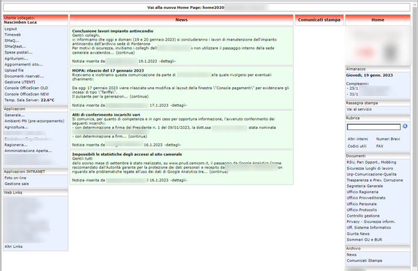

```{r setup, include=FALSE}
knitr::opts_chunk$set(echo = TRUE,
                      dev = "png",
                      dpi = 300
                      )
```
## Corso di Fondamenti di Scienza dei Dati e Laboratorio
### AA 2021 - 2022
\
\

## Introduzione

L'obiettivo del progetto è di analizzare i dati relativi alla navigazione delle pagine web di una intranet aziendale.
\
\

## Specifiche del dominio

### Contesto

Nel 2018 le Camere di Commercio di Pordenone e Udine si accorpano e viene costituito un unico Ente con due sedi nei rispettivi capoluoghi (Pordenone e Udine).\
Il processo di accorpamento è complesso e, tra i vari aspetti, comprende anche la convergenza dei sistemi informativi.\
Tale processo è tuttora in corso e viene gestito per step successivi, razionalizzando le risorse umane, economiche e tecnologiche disponibili.\
\
Tra gli asset tecnologici oggetto di integrazione ci sono le rispettive piattaforme per gestire i processi di comunicazione interna e la digitalizzazione di alcune attività originariamente gestite manualmente e/o supporto cartaceo.\
Presso la sede di Pordenone dal 2004 è in uso una intranet _web-based_ programmata in PHP su piattaforma Microsoft IIS e Microsoft SQL Server, mentre presso la sede di Udine le analoghe funzioni sono state sviluppate su architettura client - server su piattaforme Lotus Domino e FileMaker.\
\
Dopo opportune valutazioni di carattere economico e gestionale, nel 2019 si è optato per estendere alla sede di Udine l'utilizzo della intranet in uso a Pordenone e pianificando il porting su piattaforma _web-based_ delle applicazioni Lotus e FileMaker.\
\
Il primo step di questo processo ha comportato un _refactoring_ della piattaforma per migliorare alcuni aspetti di sicurezza ed un restyling estetico/funzionale per migliorare la User Experience.\
\
*Vecchia versione del portale*

\
\
*Nuova versione del portale*

\
\

### Origine e descrizione del _dataset_

Contestualmente alle operazione di _refactoring_, è stata inserita una porzione di codice per registrare nel DataBase i dati di navigazione degli utenti.
Nello specifico, per ogni **pagina richiesta** al server vengono registrate le seguenti informazioni nella tabella *home_stats* del database, che viene importata _as-is_ per la successiva elaborazione:

* *id* - Identificativo univoco del record
* *session_id* - Session ID della [sessione PHP](https://www.php.net/manual/en/book.session.php)
* *ipaddress* - Indirizzo IP del client
* *userid* - Eventuale UserID (presente se la pagina è richieste dopo aver effettuato il login aul portale)
* *req_method* - [Metodo HTTP utilizzato](https://www.rfc-editor.org/rfc/rfc7231#section-4)
* *req_uri* - [URI della pagina richiesta](https://www.rfc-editor.org/rfc/rfc7230#section-5.3)
* *exec_time* - Tempo di esecuzione dello script, in secondi (sfruttando la [funzione PHP microtime()](https://www.php.net/manual/en/function.microtime.php))
* *user_agent* - Stringa contenente lo [user-agent](https://www.rfc-editor.org/rfc/rfc7231#section-5.5.3)
* *ux_time* - Timestamp della richiesta (ottenuta tramite la [funzione PHP time()](https://www.php.net/manual/en/function.time.php))
\

Dal database viene anche mutuata parte della tabella *home_users* che contiene dati relativi agli utenti, in particolare la sede di assegnazione e il suo status (abilitato o meno):

* *userid* - User ID dell'utente
* *id_sede* - Sede di assegnazione dell'utente
* *abilitato* - Booleano per lo status dell'utente
\
\

## Obiettivi dell'analisi

L'obiettivo è di indagare il _data set_ relativamente ai seguenti aspetti:

* **Analisi temporale e geografica delle pagine richieste**
  + _Come sono distribuite le richieste per ciascuna sede?_
  + _Com'è evoluto nel tempo il numero di richieste per ciascuna sede?_
  + _Com'è l'andamento intraday delle richieste?_
\
* **Analisi del tipo di browser utilizzato**
  + _Quali sono i browser utilizzati dagli utenti?_
  + _C'è differenza tra le sedi?_
\
* **Analisi delle applicazioni (moduli della intranet) utilizzate**
  + _Quali sono le applicazioni maggiormente utilizzate?_
\
* **Performance del sistema**
  + _Qual'è il tempo medio di esecuzione degli script PHP?_
  + _Il tempo di esecuzione degli script è influenzato dall'applicazione?_
  + _Il tempo di esecuzione degli script è influenzato dalla fascia oraria?_
\
* **Analisi dell'utilizzo della rubrica**
  + _Quali sono i termini più ricercati?_
\
\

## Setup dell'ambiente di sviluppo

### Packages installati

* **Tidyverse**
  + tidyr
  + dplyr
  + lubridate
  + stringr
  + ggplot2

* **RODBC**
  + Interfaccia database ODBC

* **tm**

* **SnowballC**

* **Quanteda**

* **wordcloud**

* **Scales**


```{r message=FALSE, warning=FALSE, include=FALSE}
#Package RODBC
library(RODBC)
#Package Tidyverse
library(tidyr) 
library(dplyr) 
library(lubridate) 
library(stringr) 
library(ggplot2)
#tm
library(tm)
library(NLP)
#SnowballC
# library(SnowballC)
#Quanteda
library(quanteda)
#Package wordcloud
library(RColorBrewer)
library(wordcloud)
#Package scales
library(scales)

```

\
\

## Importazione dati da sorgente ODBC

I dati sono estratti dal DB Microsoft SQL Server aziendale.
L'accesso viene fatto tramite driver ODBC e dati vengono salvati su file csv per il successivo riutilizzo in ambiente extra-aziendale (il codice è commentato per evitare l'esecuzione in ambiente extra aziendale).

```{r}
# webdb = odbcConnect("webdb64", uid="*****", pwd="*****")
# 
# # I dati degli utenti vengono estratti escludendo dati di sicurezza (hash delle password)
# users = sqlQuery (webdb, "select userid, id_sede, abilitato from home_users;")
# 
# # Tabella richieste
# richieste = sqlFetch(webdb, "home_stats")
# 
# # Salvataggio su CSV
# write.csv(users, "users.csv")
# write.csv(richieste, "richieste.csv")
# 
# close(webdb)
```

Caricamento del data set da csv (per utilizzo extra aziendale, o con DB inaccessibile)
```{r}
users = read.csv("users.csv")
richieste = read.csv("richieste.csv")
```
\
\

## Sistemazione della tabella *richieste*

**Data e orario** della richiesta sono salvate in formato *Unix Timestamp* (tempo da Unix Epoch, in secondi).\
Si trasforma quindi il campo **ux_time** in **oggetto dataora**, rimuovendo il campo originale.

```{r}
richieste = richieste %>%
  mutate (dataora = as_datetime(ux_time)) %>%
  select (-ux_time)
```
\

Il campo **req_method** identifica il metodo utilizzato per la  HTTP-request.\
Per come è implementata la rilevazione, dovrebbero esserci solo richieste di tipo **GET**

```{r}
richieste %>%
  count (req_method) %>%
  group_by(req_method)
```

Si trovano invece alcune richieste di tipo **OPTIONS** e **PROPFIND**, verosimilmente generate da *BOT* o *Web Crawler*.\
Decido di filtrare questo tipo di richieste in quanto non significative ai fini della rilevazione.\
Si procede inoltre ad eliminare il campo **req_method** in quanto non più significativo.\

```{r}
richieste = richieste %>%
  filter (req_method == "GET") %>%
  select (-req_method)
```
\

Il codice per la registrazione delle richieste è stato implementato nel corso del mese di aprile 2021, quindi il primo mese completo di rilevazione è **maggio 2021**.\
Si procede quindi a filtrare i dati del periodo **dal 01.05.2021 al 31.12.2022**, ultimo mese completo disponibile al momento dell'analisi.\
Vengono escluse anche le pagine richieste dagli host aventi IP address 10.22.6.143 e 10.29.5.172, in quanto corrispondeno a postazioni di sviluppo, test e security audit, e che quindi generano numerose richieste non significative.\

```{r}
richieste = richieste %>%
  filter (dataora >= "2021-05-01", dataora<='2022-12-31', ipaddress != "10.22.6.143", ipaddress != "10.29.5.172")
```
\

Risulterà utile distinguere le richieste provenienti dalla sede di Udine da quelle provenienti dalla sede di Pordenone.\
Per fare questo si sfrutta il fatto che le due sedi utilizzano due _subnet_ diverse:

* 10.29.x.x identifica il traffico proveniente dalla sede di Udine
* 10.22.x.x identifica il traffico proveniente dalla sede di Pordenone

Le richieste provenienti da indirizzi IP non appartenenti a queste subnet si riferiscono a client operanti al di fuori di queste due sedi (tipicamente client da VPN), e non sono quindi riconducibili a nessuna delle due sedi.

```{r}
richieste = richieste %>%
  mutate (sede = case_when(
    str_detect(ipaddress,"10.29.") ~ "UD",
    str_detect(ipaddress,"10.22.") ~ "PN",
    TRUE ~ "Other"))
```
\
\

## Analisi temporale e geografica delle pagine richieste

### Numero utenti per sede

Per valutare correttamente la portata del numero di richieste proveniente dalle sedi, si procede preliminarmente alla valutazione della distribuzione degli utenti per ciascuna sede. (Nel tabella estratta da databse di riferimento la sede di PN è identificata con id_sede = 1, la sede di Udine è identificata con id_sede = 2)

```{r}
users = users %>% 
  filter (abilitato == 1) %>%
  mutate (sede = case_when(
    id_sede==2 ~ "UD", 
    id_sede==1 ~ "PN"))

utenti_per_sede = users %>%
  group_by(sede) %>%
  summarise(n=n()) %>%
  mutate (distribuzione = "Utenti", perc = n/sum(n))

utenti_per_sede
```

### Come sono distribuite le richieste per ciascuna sede?

Una prima analisi mira a capire come sono distribuite le richieste HTTP **rispetto alla sede di provenienza**.

```{r}
richieste_per_sede = richieste %>% 
  group_by(sede) %>% 
  summarise(n=n()) %>%
  arrange (desc(n)) %>%
  mutate (distribuzione = "Richieste", perc = n / sum(n))
richieste_per_sede
```

Le richieste provenienti da subnet diverse da quelle delle sedi di PN e UD sono trascurabili e non verranno ulteriormente indagate.
```{r}
richieste = richieste %>% filter (sede != "Other")
richieste_per_sede = richieste_per_sede %>% filter (sede != "Other")
```

Si visualizza la distribuzione delle richieste confrontate con la distribuzione degli utenti, per sede
```{r utenti_richieste}
glob = rbind(utenti_per_sede, richieste_per_sede)

ggplot(glob, aes(x=sede, y=perc, fill=distribuzione)) +
    geom_bar(stat='identity', position='dodge') + 
  theme(panel.grid.major.x = element_blank(),
        panel.grid.minor.x = element_blank()) +
    labs(title="Distribuzione utenti e richieste, per sede", x="Sede", y = "distribuzione")
    
```
\
Il grafico a barre evidenzia che dalla sede di Udine vengono generate ancora relativamente poche richieste rispetto al numero degli utenti della sede. Questo conferma che la sede di Udine è ancora in una fase iniziale di adozione dello strumento, con notevole potenziale di crescita.\
\

Si procede raggruppando le richieste per sede e per mese, visualizzando quindi il dato in un boxplot

```{r message=FALSE, warning=FALSE}
mensili = richieste %>%
  group_by(mese = floor_date(dataora, unit = "month"), sede) %>%
  summarise(n=n())
```

```{r distrib_richieste_mensile}
ggplot (mensili, aes(sede, n, color=sede)) +
  geom_boxplot() +
  theme(legend.position='none') +
    theme(panel.grid.major.x = element_blank(),
        panel.grid.minor.x = element_blank()) +
  labs(title="Disribuzione numero mensile di pagine richieste, per sede", x="Sede", y = "# richieste")
```
\
Il boxplot evidenzia che l'andamento mensile delle richieste di Udine non ha avuto particolari picchi positivi o negativi. Le richieste dalla sede di Pordenone presentano invece una variabiltà maggiore, giustificabile considerando il numero più elevato di richieste in termini di valore assoluto.
\

### Come è evoluto nel tempo il numero di richieste per ciascuna sede?

Per comprendere con quale velocità le sedi stanno adottando lo strumento, si procede con una analisi temporale sfruttando la serie storica disponibile (maggio 2021 - dicembre 2022).

Essendo lo strumento in fase di adozione, è interessante indagare sul trend delle richieste generate da ciascuna delle sedi.\
Viene pertanto generato un grafico di dispersione, al quale si aggiunge una retta parametrizzata secondo un modello lineare ottenuto dai dati. 

```{r trend_richieste_mensile}
mensiliPN = mensili %>%
  filter (sede=="PN")
mensiliUD = mensili %>%
  filter (sede=="UD")

modPN = lm(n~mese, data=mensiliPN)
modUD = lm(n~mese, data=mensiliUD)

ggplot(mensili, aes(mese, n, color=sede)) +
  geom_point(size=2) +
  geom_abline(intercept = modPN$coefficients[1], 
              slope = modPN$coefficients[2], 
              color = "red", linewidth = 1.5) + 
    geom_abline(intercept = modUD$coefficients[1], 
              slope = modUD$coefficients[2], 
              color = "turquoise", linewidth = 1.5) +
    theme(legend.position = c(0.1, 0.85)) +

    labs(title="Numero mensile di pagine richieste, per sede", x="Mese", y = "# richieste")

```
\

Il grafico mostra che le richieste dalla sede di Pordenone hanno tasso di crescita maggiore di quello di Udine, nonostante la sede di Pordenone utilizzi lo strumento da più tempo.\
La sede di Udine invece dimostra ancora un trend debolmente crescente.\
E' verosimile che con il progredire del porting sulla intranet delle applicazioni Lotus e FileMaker, il trend per la sede di Udine migliorerà notevolmente.
\

### Com'è l'andamento _intraday_ delle richieste?

E' interessante indagare quali sono le fasce orarie di maggior utilizzo della Intranet, per capire le abitudini degli utenti. Questo aspetto può essere significativo ad esempio per pianificare attività manutentive sul portale in fasce orarie poco "affollate". Inoltre puà dare una misura del corretto dimensionamento dell'infrastruttura dal punto di vista delle prestazioni a fronte di picchi di lavoro.\
Per fare questo si procede a raggruppare le richieste per fascia oraria.\
Il nuovo campo _fascia_oraria_ riporta l'estremo inferiore dell'intervallo (es: la fascia dalle 8.00 alle 8.59 è indicata con intero "8").
```{r}
richieste = richieste %>% mutate (fascia_oraria = hour(floor_date(dataora, unit="hour")))
```
\
La fascia oraria generata necessita di un aggiustamento, in quanto l'orario originale sul DB è uno orario GMT.\
Alla fascia quindi va aggiunto un opportuno _off-set_ in funzione dell'ora solare (+1) o legale (+2), normalizzado tutti gli orari all'ora legale.
```{r}
richieste = richieste %>%
  mutate(fascia_oraria = case_when(
    dataora < "2021-10-31" ~ fascia_oraria +2,
    dataora %within% interval (ymd("2021-10-31"), ymd("2022-03-27")) ~ fascia_oraria +1,
    dataora %within% interval (ymd("2022-03-28"), ymd("2022-10-30")) ~ fascia_oraria +2,
    dataora > "2022-10-30" ~ fascia_oraria +1
  ))
```
\
Si procede quindi a generare un istogramma per rappresentare l'andamento delle richieste per fascia oraria e per sede.
```{r intraday_richieste}
ggplot(richieste, aes(x=fascia_oraria)) +
  geom_histogram(binwidth=1,color="red", fill="grey") + 
  facet_wrap("sede") +
  labs(title="Distribuzione richieste per fascia oraria", x="Fascia oraria", y = "# richieste")
```
\

Il grafico evidenzia che le richieste sono concentrate nella fascia antimeridiana, con un picco nella fasce orarie 8-9 e 9-10.\
Fatte le dovute proporzioni, l'andamento è sovrapponibile per le due sedi.\
Il picco di richieste nella fascia oraria 8-9 per la sede di Pordenone è dovuto al fatto che, per ragioni storiche, gli utenti di Pordenone utilizzano la intranet come pagina iniziale all'apertura del browser.
\
\

## Analisi del tipo di browser utilizzato

**Quali sono i browser utilizzati dagli utenti?**
**C'è differenza tra le sedi?**

Di particolare interesse risulta indagare sul browser utilizzato dagli utenti.\
L'ente non impone l'utilizzo di un particolare browser, anche se il reparto IT indica come preferibile l'utilizzo di Google Chrome per una migliore compatabilità con la suite Google Workspace adottata.\
Per ragioni di compatibilità è infatti ammesso l'uso di qualsiasi browser purchè supportato dal relativo produttore.\
\

Il browser può essere identificato ispezionando il valore del dataset **user_agent**.\
[RFC 7231 - Sezione 5.5.3](https://www.rfc-editor.org/rfc/rfc7231#section-5.5.3)
\
Per l'identificazione mi sono avvalso di alcuni _pattern_ reperiti in rete.\
[Articolo su developer.mozilla.org](https://developer.mozilla.org/en-US/docs/Web/HTTP/Browser_detection_using_the_user_agent)
\

```{r}
richieste = richieste %>% mutate (browser = "Other")

richieste = richieste %>%
  mutate(browser = case_when(
    str_detect(user_agent, "Firefox\\/\\d*") ~ "Firefox",
    str_detect(user_agent, "; MSIE \\d*") ~ "IE10",
    str_detect(user_agent, "Trident\\/7.0; .*rv:\\d*") ~ "IE11",
    str_detect(user_agent, "Edg/") ~ "Edge",
    str_detect(user_agent, "Chrome/") ~ "Chrome",
    TRUE ~ "Other"
  ))
```
\
Di seguito si visualizza la distribuzione generale, quindi quella per sede.

```{r richieste_browser1}
browser = richieste %>% group_by(browser, sede) %>% count() %>%
  mutate (perc = n / nrow(richieste))

ggplot(richieste) +
  geom_bar(aes(browser, fill = browser)) +
  theme(legend.position='none') +
  labs(title="Distribuzione richieste per browser utilizzato", x="Browser", y = "# richieste")

```

```{r richieste_browser2}
ggplot(richieste) +
  geom_bar(aes(browser, fill = browser)) +
  facet_wrap("sede") +
  theme(legend.position='none') +
  labs(title="Distribuzione richieste per browser utilizzato, per sede", x="Browser", y = "# richieste")
```
\

Si conferma la netta prevalenza dell'uso del browser Google Chrome, per entrambe le sedi.\
Interessante osservare che presso la sede di PN è presente una quota di richieste provenienti da browser Microsoft Edge (nella nuova versione Chrome - based).
\
Da approfondire il dato relativo all'utilizzo di IE10/IE11, considerato che il prodotto è in _end-of-life_ e verrà automaticamente disabilitato nel corso del mese di febbraio 2023.
\
Si decide pertanto di verificare l'evoluzione nel tempo dell'uso di browser IE10/IE11, tracciando uno scatterplot per sede con l'aggiunta di una retta che modella l'andamento.
\
\
```{r richieste_browser_IE, message=FALSE, warning=FALSE}
mensiliIE = richieste %>% filter (str_detect(browser, "IE")) %>%
  group_by(mese = floor_date(dataora, unit = "month"), sede) %>%
  summarise(n=n())

mensiliPNIE = mensiliIE %>%
  filter (sede=="PN")
mensiliUDIE = mensiliIE %>%
  filter (sede=="UD")

modPNIE = lm(n~mese, data=mensiliPNIE)
modUDIE = lm(n~mese, data=mensiliUDIE)

ggplot(mensiliIE, aes(mese, n, color=sede)) +
  geom_point(size=3) +
  geom_abline(intercept = modPNIE$coefficients[1], 
              slope = modPNIE$coefficients[2], 
              color = "red", linewidth = 1.5) + 
  geom_abline(intercept = modUDIE$coefficients[1], 
              slope = modUDIE$coefficients[2], 
              color = "turquoise", linewidth = 1.5) +
  theme(legend.position = c(0.9, 0.8)) +
  labs(title="Numero mensile di pagine richieste da browser IE (10 e 11), per sede", x="Mese", y = "# richieste")

```
\
L'analisi è di conforto, perchè è evidente il progressivo abbandono del browser IE10/IE11.\
I dati rilevati a dicembre 2022 mostrano infatti un numero residuo di richieste inferiore alle 100 unità per entrambe le sedi (prossimo allo zero per la sede di Udine).\
\


## Analisi dell'utilizzo delle applicazioni della Intranet

Attraverso il portale vengono erogati alcuni servizi, desumibili dalla URI contenuta nella tabella **richieste**.
\
Alla tabella **richieste** viene pertanto aggiunto un nuovo campo identificando l'applicazione utilizzata, secondo il seguente schema:

* **Homepage**
* **Rubrica**: piccolo motore per la ricerca dei contatti aziendali
* **OdsCom**: applicazione per la distribuzone dei Ordini di Servizio / Comunicazioni
* **Documenti**: repository di documenti di interesse aziendale
* **News**: gestione e consultazione di _news_ di interesse aziendale
* **UserProfile**: gestione del proprio profilo utente

Vengono inoltre identificate alcune richieste residue tipicamente generate da errori di compilazione di *form* presenti in applicazioni della intranet, e vengono raggruppate le rimanenti richieste sotto la voce "Other".
```{r}
richieste = richieste %>%
  mutate (application = case_when(
    req_uri=="/" ~ "Homepage",
    req_uri=="/default.php" ~ "Homepage",
    str_detect(req_uri, "rubrica") ~ "Rubrica",
    str_detect(req_uri, "odscom*") ~ "OdsCom",
    str_detect(req_uri, "pagina=documenti") ~ "Documenti",
    str_detect(req_uri, "error") ~ "Error",
    str_detect(req_uri, "gestionenews|news*") ~ "News",
    str_detect(req_uri, "userprofile|usermanage") ~ "UserProfile",
    TRUE ~ "Other")
  )
```
\
\

### Quali sono le applicazioni più utilizzate?

Innanzi tutto vengono raggruppate le richieste per applicazione, e viene generato un barplot per confrontare l'utilizzo delle applicazioni in ciascuna sede.
\
```{r applicazioni}
richieste %>%
  group_by(application) %>%
  summarise(n=n()) %>%
  arrange (desc(n))

ggplot(richieste %>% filter (application!="Homepage", application!="Other")) +
  geom_bar(aes(sede, fill=sede)) +
  coord_flip() +
  facet_wrap("application") +
  theme(legend.position='none') +
  labs(title="Pagine richieste per applicazione e per sede", x="# richieste", y = "Sede")


```
\
Da questa visualizzazione si nota che alcuni moduli  (OdsCom, UserProfile, News) sono utilizzate presso le due sedi in misura proporzionale al numero di utenti potenziali (UD > PN).
\
Due applicazioni particolari invece (Documenti e Rubrica) sono usate prevalentemente a Pordenone.
\
E' utile quindi indagare sull'andamento storico dell'utilizzo di queste due applicazioni, per capire se ci si può attendere un'evoluzione .
\
```{r applicazioni_documenti, message=FALSE, warning=FALSE}
mensiliDoc = richieste %>% filter (application == "Documenti") %>%
  group_by(mese = floor_date(dataora, unit = "month"), sede) %>%
  summarise(n=n())

mensiliPNDoc = mensiliDoc %>%
  filter (sede=="PN")
mensiliUDDoc = mensiliDoc %>%
  filter (sede=="UD")

modPNDoc = lm(n~mese, data=mensiliPNDoc)
modUDDoc = lm(n~mese, data=mensiliUDDoc)

ggplot(mensiliDoc, aes(mese, n, color=sede)) +
  geom_point(size=3) +
  geom_abline(intercept = modPNDoc$coefficients[1], 
              slope = modPNDoc$coefficients[2], 
              color = "red", linewidth = 1.5) + 
    geom_abline(intercept = modUDDoc$coefficients[1], 
              slope = modUDDoc$coefficients[2], 
              color = "turquoise", linewidth = 1.5) +
    theme(legend.position = c(0.9, 0.85)) +
    labs(title="Storico richieste applicazione Documenti, per sede", x="Mese", y = "# richieste")
```
\
Per quanto riguarda il modulo **Documenti** non si apprezza un chiaro trend, ma l'analisi appare disturbata da alcuni picchi apparentemente anomali riscontrati tra agosto e dicembre 2021, in assenza dei quali si apprezzerebbe un trend positivo. I picchi sono probabilmente dovuti ad un _hype_ generato da una prima corposa pubblicazione di documenti.
\

```{r applicazioni_rubrica, message=FALSE, warning=FALSE}
mensiliRub = richieste %>% filter (application == "Rubrica") %>%
  group_by(mese = floor_date(dataora, unit = "month"), sede) %>%
  summarise(n=n())

mensiliPNRub = mensiliRub %>%
  filter (sede=="PN")
mensiliUDRub = mensiliRub %>%
  filter (sede=="UD")

modPNRub = lm(n~mese, data=mensiliPNRub)
modUDRub = lm(n~mese, data=mensiliUDRub)

ggplot(mensiliRub, aes(mese, n, color=sede)) +
  geom_point(size=3) +
  geom_abline(intercept = modPNRub$coefficients[1], 
              slope = modPNRub$coefficients[2], 
              color = "red", linewidth = 1.5) + 
    geom_abline(intercept = modUDRub$coefficients[1], 
              slope = modUDRub$coefficients[2], 
              color = "turquoise", linewidth = 1.5) +
    theme(legend.position = c(0.9, 0.15)) +
    labs(title="Storico richieste applicazione Rubrica, per sede", x="Mese", y = "# richieste")

```
\
Il trend per il modulo Rubrica è invece più chiaramente individuabile: l'utilizzo della Rubrica ha avuto un costante aumento nel periodo osservato, con una _slope_ più elevata per Udine, tanto che nell'ultimo periodo osservato le due sedi hanno generato un numero di richieste sovrapponibile.
\

## Performance del sistema

### Analisi tempo di esecuzione dello script PHP

Una prima analisi viene effettuata sulla totalità delle richieste, plottando un boxplot e un grafico a dispersione

```{r exec_time1}
richieste %>% summarize(median(exec_time))

ggplot(richieste)+
  geom_boxplot(aes(x=exec_time)) +
  coord_cartesian(xlim = quantile(richieste$exec_time, c(0, 0.999))) +
  theme(axis.title.y=element_blank(),
        axis.text.y=element_blank(),
        axis.ticks.y=element_blank(),
    panel.grid.major.y = element_blank(),
        panel.grid.minor.y = element_blank()) +
  labs(title="Distribuzione del tempo di esecuzione degli script", x="Exec-time, in secondi")

```
\
Si può notare che il tempo di esecuzione presenta una distribuzione caratterizzata da una coda lunga a destra, con una tempo di esecuzione mediano di 0.185s; sono presenti inoltre numerosi _outliers_ sulla coda destra.

### L'applicazione influenza il tempo di esecuzione?

Si vuole indagare quali variabili influiscano il tempo di esecuzione dello script che genera la pagina.\
La prima idea è di verificare se le diverse applicazioni presentino tempi di esecuzioni diversi.\
L'analisi si concentrerà sulle applicazioni con il maggiorn numero di richieste, per avere dei dati maggiormente significativi.\
Si procede quindi a plottare un grafico a dispersione generale ed un boxplot per le applicazioni maggiormente utilizzae\


```{r}
ggplot(richieste)+
  geom_point(aes(x=exec_time, y=application), alpha = 0.05)
```

```{r exec_time2}
ggplot(richieste %>% filter (application != "Other", application != "Error", application != "UserProfile", application != "News")) +
  geom_boxplot(aes(x=exec_time), outlier.shape = NA) +
  coord_cartesian(xlim = quantile(richieste$exec_time, c(0, 0.996))) +
    theme(axis.title.y=element_blank(),
        axis.text.y=element_blank(),
        axis.ticks.y=element_blank(),
    panel.grid.major.y = element_blank(),
        panel.grid.minor.y = element_blank()) +
  facet_wrap("application") +
    labs(title="Distribuzione del tempo di esecuzione degli script, per alcune applicazioni", x="Exec-time, in secondi")
```
\
Si nota una distribuzione nettamente diversa per l'applicazione OdsCom, mentre le altre analizzate hanno un comportamento sovrapponibile a quello generale.\
Da notare che sia l'applicazione "Documenti" sia l'applicazione "OdSCom" sono caratterizzate dall'accesso al file system, particolare che avrebbe potuto influire sul tempo di esecuzione, cosa che invece non viene evidenziata dall'analisi.\
L'altro fattore che potrebbe influire è il fatto che la pagina sia stata richiesta prima o dopo aver effettuato il login utente, in quanto dopo il login la generazione della pagina comporta uan maggiore complessità degli script da eseguire (in particolare in termini di numero di query sul db).\
Procediamo quindi a caratterizzare le richieste per questo fattore.
\
Innanzi tutto creo un nuovo campo _logged_in_ impostandolo a TRUE o FALSE, in base alla presenza o meno in tabella del valore "userid".

```{r}
richieste = richieste %>% 
  mutate (logged_in = case_when(
    userid=="" ~ FALSE,
    TRUE ~ TRUE))
```

\
Si passa quindi a plottare un boxplot sul tempo di esecuzione, suddiviso per log-in status

```{r exec_time3, message=FALSE, warning=FALSE}
rlg = richieste %>% 
  select (application, logged_in, exec_time) %>% 
  group_by(application, logged_in) %>% 
  summarize(m = median(exec_time))

ggplot (richieste) +
  geom_boxplot(aes(exec_time, logged_in), outlier.shape = NA) +
  coord_cartesian(xlim = quantile(richieste$exec_time, c(0, 0.98))) +
      labs(title="Distribuzione del tempo di esecuzione degli script, per log-in status", 
           y="Log-in status", x="Exec-time, in secondi")

```
\
Dal grafico è evidente che il login status è determinante rispetto al tempo di esecuzione degli script.
\
Ad ulteriore conferma, proviamo a plottare un boxplot analogo relativamente alle applicazioni utilizzabili anche senza log-in:

```{r exec_time4, message=FALSE, warning=FALSE}
ggplot (richieste %>% filter (application!="Error", 
                              application!="News", 
                              application!="OdsCom",
                              application!="UserProfile",
                              application!="Other") )+
  geom_boxplot(aes(logged_in, exec_time), outlier.shape = NA) +
  coord_cartesian(ylim = quantile(richieste$exec_time, c(0, 0.98))) +
  facet_wrap("application") +
        labs(title="Distribuzione tempo esecuzione script per alcune applicazioni, per log-in status", 
           x="Log-in status", y="Exec-time, in secondi")
```
\
Dal boxplot risulta evidente che le richieste "logged_in" hanno un tempo di esecuzione di molte volte maggiore, anche per applicazioni il cui login non è necessario e non incide quindi sull'esecuzione dell'applicazione stessa.\
A questo punto il fattore che influisce sul tempo di esecuzione è giustificabile dalle parti di script che vengono eseguite solo ad utente loggato, come la generazione del menù personalizzato e la generazione dell'area delle notifiche.

### L'orario influenza il tempo di esecuzione?

Un'ultima curiosità riguarda l'influenza della fascia oraria sul tempo di esecuzione, ipotizzando che nelle fasce con il maggior numero di richieste si possa riscontrare un tempo di esecuzione maggiore.\
Allo scopo si esamina la distribuzione del tempo di esecuzione nella fascia di punta (8-9) con una delle fasce di fine giornata lavorativa (17-18):
\

```{r exec_time_fasce}
ggplot(richieste %>% filter ((fascia_oraria==8) | (fascia_oraria==17))) +
  geom_boxplot(aes(y=exec_time), outlier.shape = NA) +
  coord_cartesian(ylim = quantile(richieste$exec_time, c(0.001, 0.997))) +
      theme(axis.title.x=element_blank(),
        axis.text.x=element_blank(),
        axis.ticks.x=element_blank()) +
  facet_wrap("fascia_oraria") +
  
          labs(title="Distribuzione tempo esecuzione script in particolari fasce orarie", 
           y="Exec-time, in secondi")
```
\
Non solo non si riscontrano differenze significative, ma la distrubuzione della fascia 17-18 riporta addirittura valori più mediani ed interquartili elevati, anche se non in modo particolarmente significativo.\
Pertanto si conclude che nelle fasce di punta non ci sia un tempo di esecuzione significativamente differente dalle altre fasce, e pertanto l'infratstrtuttura appare al momento adeguatamente dimensionata al carico di lavoro.


## Analisi dell'utilizzo della rubrica

### Quali sono i termini più ricercati?

Come ultima curiosità si procede ad un'analisi sui termini utilizzati nella ricerca sulla rubrica interna.\
Con alcune semplici tecniche di text-mining si isolano le chiavi di ricerca, si ottimizza il dataset predisponendolo alla generazione della _Term Document Matrix_ e al plot di un _wordcloud_ 

```{r wordcloud, message=FALSE, warning=FALSE}
#isolo la colonna req_uri per le richieste da applicazione "Rubrica"
chiavi = richieste %>% 
  filter(application=="Rubrica") %>% 
  select (req_uri)

# separo la stringa contenente la key
chiavi = chiavi %>% separate(req_uri, c("app", "key"), "key=")

#rimuovo le key vuote
chiavi = chiavi %>% filter (key!="") %>% select (-app)

#trasformo tutte le parole in minuscolo
chiavi = chiavi %>% mutate (key = str_to_lower(key)) 

#trasformo il dataframe in oggetto corpus
corp <- corpus(chiavi, text_field="key")

#creo la document matrix
dtm <- TermDocumentMatrix(corp)
m <- as.matrix(dtm)
v <- sort(rowSums(m),decreasing=TRUE)
d <- data.frame(word = names(v),freq=v)

#visualizzo le prime 100 parole di ricerca
head(d, 100)

# genero la wordcloud
wordcloud(words = d$word, freq = d$freq, min.freq = 10,
          max.words=200, random.order=FALSE, rot.per=0.35, scale=c(2, .5), 
          colors=brewer.pal(8, "Dark2"))

```
Il **wordcloud** evidenzia che viene utilizzata con netta prevalenza la modalità di ricerca "per nome persone", mentre le ricerche "per ufficio" e "per numero" sono usate sporadicamente.