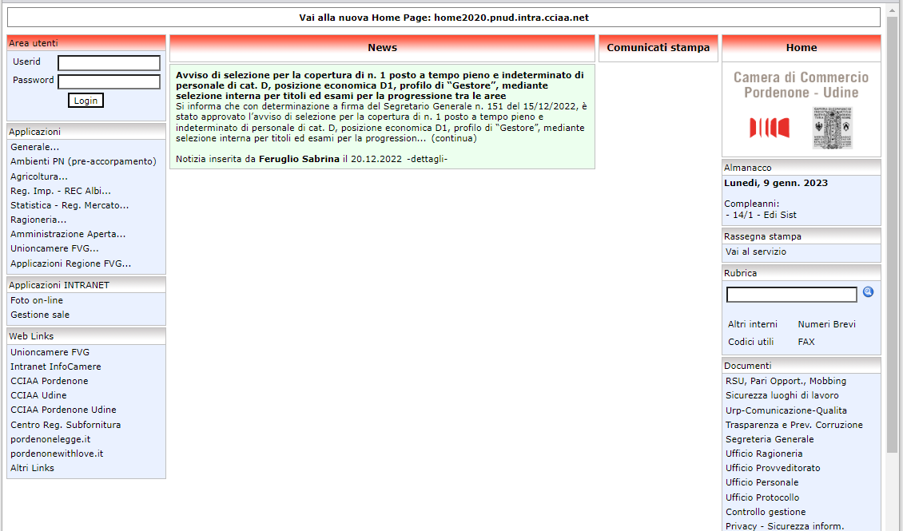
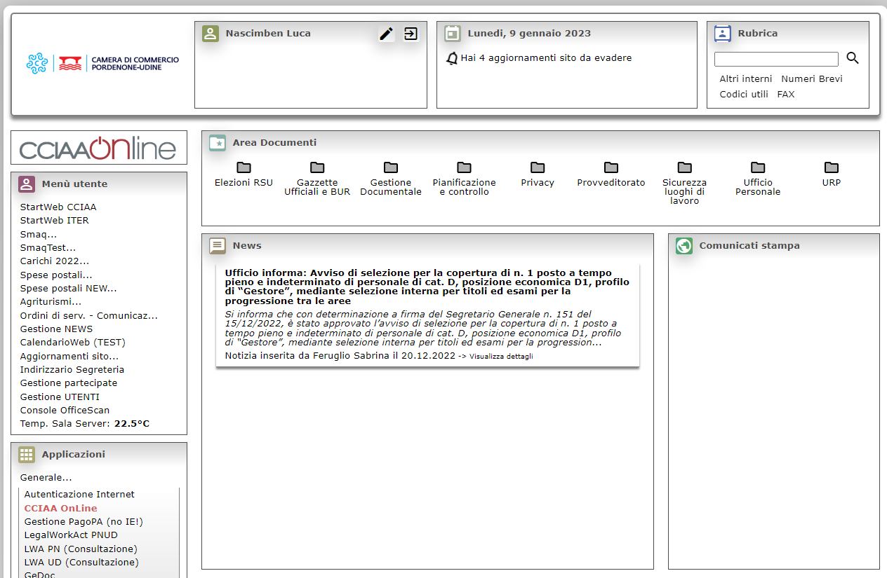

```{r setup, include=FALSE}
knitr::opts_chunk$set(echo = FALSE)
```

## Introduzione (1)

**Obiettivo dell'analisi**

L'obiettivo del progetto è di analizzare i dati relativi alla navigazione delle pagine web di una intranet aziendale.

**Contesto**

- Nel 2018 gli Enti "X" di Pordenone e Udine si accorpano e viene costituito un unico Ente "X" con due sedi nei rispettivi capoluoghi (Pordenone e Udine), con conseguente necessità di integrare processi e _asset_, anche tecnologici.
- Tra gli _asset_ tecnologici oggetto di integrazione ci sono le rispettive piattaforme per gestire la comunicazione interna e la digitalizzazione di alcuni processi:

  + Pordenone -> piattaforma _web-based_ (Intranet)
  + Udine -> architettura client - server su piattaforme Lotus Domino e FileMaker.

## Introduzione (2)

L'Ente opta per avviare in processo di dismissione delle piattaforme *client-server based* in uso presso la sede di Udine effettuando il *porting*  delle applicazioni sulla piattaforma web-based in uso presso la sede di Pordenone.

Il primo step di questo processo ha comportato un _refactoring_ della vecchia intranet.




Contestualmente alle operazione di _refactoring_, è stata inserita una porzione di codice per registrare nel DataBase i **dati di navigazione degli utenti**.

## Origine e descrizione del _dataset_

Per ogni **pagina richiesta** al server vengono registrate nel DB le seguenti informazioni utilizzate per l'analisi:

- *id* - Identificativo univoco del record
- *session_id* - Session ID della [sessione PHP](https://www.php.net/manual/en/book.session.php)
- *ipaddress* - Indirizzo IP del client
- *userid* - Eventuale UserID (presente se la pagina è richieste dopo aver effettuato il login aul portale)
- *req_method* - [Metodo HTTP utilizzato](https://www.rfc-editor.org/rfc/rfc7231#section-4)
- *req_uri* - [URI della pagina richiesta](https://www.rfc-editor.org/rfc/rfc7230#section-5.3)
- *exec_time* - Tempo di esecuzione dello script, in secondi (sfruttando la [funzione PHP microtime()](https://www.php.net/manual/en/function.microtime.php))
- *user_agent* - Stringa contenente lo [user-agent](https://www.rfc-editor.org/rfc/rfc7231#section-5.5.3)
- *ux_time* - Timestamp della richiesta (ottenuta tramite la [funzione PHP time()](https://www.php.net/manual/en/function.time.php))

Dal DB viene anche mutuata parte della tabella *utenti*:

- *userid* - User ID dell'utente
- *id_sede* - Sede di assegnazione dell'utente
- *abilitato* - Booleano per lo status dell'utente

Al momento della preparazione di questa slide la tabella conta oltre 234.000 righe.\
Dopo opportune considerazioni, il dataset esaminato viene ridotto a circa 210.000 righe.

## Obiettivi dell'analisi

- **Analisi temporale e geografica**
  + _Come sono distribuite le richieste per ciascuna sede?_
  + _Com'è evoluto nel tempo il numero di richieste per ciascuna sede?_
  + _Com'è l'andamento intraday delle richieste?_
  
- **Analisi del tipo di browser utilizzato**
  + _Quali sono i browser utilizzati dagli utenti?_
  + _C'è differenza tra le sedi?_
  
- **Analisi delle applicazioni (moduli della intranet) utilizzate**
  + _Quali sono le applicazioni maggiormente utilizzate?_
  
- **Performance del sistema**
  + _Qual'è il tempo medio di esecuzione degli script PHP?_
  + _Da cosa è influenzato Il tempo di esecuzione degli script?_

- **Analisi dell'utilizzo della rubrica**
  + _Quali sono i termini più ricercati?_

**NB: Periodo di riferimento dal 01.05.2021 al 31.12.2022**

```{r message=FALSE, warning=FALSE, include=FALSE}
#Package RODBC
library(RODBC)
#Package Tidyverse
library(tidyr) 
library(dplyr) 
library(lubridate) 
library(stringr) 
library(ggplot2)
#tm
library(tm)
library(NLP)
#SnowballC
# library(SnowballC)
#Quanteda
library(quanteda)
#Package wordcloud
library(RColorBrewer)
library(wordcloud)
#Package scales
library(scales)
```
```{r message=FALSE, warning=FALSE, include=FALSE}
users = read.csv("users.csv")
richieste = read.csv("richieste.csv")
```
```{r message=FALSE, warning=FALSE, include=FALSE}
richieste = richieste %>%
  mutate (dataora = as_datetime(ux_time)) %>%
  select (-ux_time)
```
```{r include=FALSE}
richieste %>%
  count (req_method) %>%
  group_by(req_method)
```

```{r}
richieste = richieste %>%
  filter (req_method == "GET") %>%
  select (-req_method)
```
```{r}
richieste = richieste %>%
  filter (dataora >= "2021-05-01", dataora<='2022-12-31', ipaddress != "10.22.6.143", ipaddress != "10.29.5.172")
```
```{r}
richieste = richieste %>%
  mutate (sede = case_when(
    str_detect(ipaddress,"10.29.") ~ "UD",
    str_detect(ipaddress,"10.22.") ~ "PN",
    TRUE ~ "Other"))
```

## Analisi temporale e geografica (1)

***Come sono distribuite le richieste per ciascuna sede?***

```{r}
users = users %>% 
  filter (abilitato == 1) %>%
  mutate (sede = case_when(
    id_sede==2 ~ "UD", 
    id_sede==1 ~ "PN"))

utenti_per_sede = users %>%
  group_by(sede) %>%
  summarise(n=n()) %>%
  mutate (distribuzione = "Utenti", perc = n/sum(n))
```
```{r}
richieste_per_sede = richieste %>% 
  group_by(sede) %>% 
  summarise(n=n()) %>%
  arrange (desc(n)) %>%
  mutate (distribuzione = "Richieste", perc = n / sum(n))
```
```{r}
richieste = richieste %>% filter (sede != "Other")
richieste_per_sede = richieste_per_sede %>% filter (sede != "Other")
```
```{r utenti_richieste}
glob = rbind(utenti_per_sede, richieste_per_sede)

ggplot(glob, aes(x=sede, y=perc, fill=distribuzione)) +
    geom_bar(stat='identity', position='dodge') + 
  theme(panel.grid.major.x = element_blank(),
        panel.grid.minor.x = element_blank()) +
    labs(title="Distribuzione utenti e richieste, per sede", x="Sede", y = "distribuzione")
```
\
Dalla sede di Udine vengono generate relativamente poche richieste rispetto al numero degli utenti.<br>Questo conferma che la sede di Udine è ancora in una fase iniziale di adozione dello strumento; ritengo che con l'avanzare del *porting* delle applicazioni.

```{r message=FALSE, warning=FALSE}
mensili = richieste %>%
  group_by(mese = floor_date(dataora, unit = "month"), sede) %>%
  summarise(n=n())
```

## Analisi temporale e geografica (2)

***Come sono distribuite le richieste per ciascuna sede?***

```{r distrib_richieste_mensile}
ggplot (mensili, aes(sede, n, color=sede)) +
  geom_boxplot() +
  theme(legend.position='none') +
    theme(panel.grid.major.x = element_blank(),
        panel.grid.minor.x = element_blank()) +
  labs(title="Distribuzione numero mensile di pagine richieste, per sede", x="Sede", y = "# richieste")
```
\
PN ~ 7.300 richieste/mese, UD ~ 3.250 richieste/mese
L'andamento mensile delle richieste di Udine non ha avuto particolari picchi positivi o negativi.\
Le richieste dalla sede di Pordenone presentano invece una variabiltà maggiore.

## Analisi temporale e geografica (3)

***Come è evoluto nel tempo il numero di richieste per ciascuna sede?***

```{r trend_richieste_mensile}
mensiliPN = mensili %>%
  filter (sede=="PN")
mensiliUD = mensili %>%
  filter (sede=="UD")

modPN = lm(n~mese, data=mensiliPN)
modUD = lm(n~mese, data=mensiliUD)

ggplot(mensili, aes(mese, n, color=sede)) +
  geom_point(size=2) +
  geom_abline(intercept = modPN$coefficients[1], 
              slope = modPN$coefficients[2], 
              color = "red", linewidth = 1.5) + 
    geom_abline(intercept = modUD$coefficients[1], 
              slope = modUD$coefficients[2], 
              color = "turquoise", linewidth = 1.5) +
    theme(legend.position = c(0.1, 0.85)) +

    labs(title="Numero mensile di pagine richieste, per sede", x="Mese", y = "# richieste")
```
\
Le richieste dalla sede di Pordenone crescono più di quelle di Udine.\
Ci si attende che con il progredire del porting delle applicazioni Lotus e FileMaker, il trend per la sede di Udine migliori.

## Analisi temporale e geografica (4)

***Com'è l'andamento _intraday_ delle richieste?***
```{r}
richieste = richieste %>% mutate (fascia_oraria = hour(floor_date(dataora, unit="hour")))
```
```{r}
richieste = richieste %>%
  mutate(fascia_oraria = case_when(
    dataora < "2021-10-31" ~ fascia_oraria +2,
    dataora %within% interval (ymd("2021-10-31"), ymd("2022-03-27")) ~ fascia_oraria +1,
    dataora %within% interval (ymd("2022-03-28"), ymd("2022-10-30")) ~ fascia_oraria +2,
    dataora > "2022-10-30" ~ fascia_oraria +1
  ))
```
```{r intraday_richieste}
ggplot(richieste, aes(x=fascia_oraria)) +
  geom_histogram(binwidth=1,color="red", fill="grey") + 
  facet_wrap("sede") +
  labs(title="Distribuzione richieste per fascia oraria", x="Fascia oraria", y = "# richieste")
```
\
Le richieste sono concentrate nella fascia antimeridiana, con un picco nella fasce orarie 8-9 e 9-10.\
L'andamento è sovrapponibile per le due sedi.

## Analisi del tipo di browser utilizzato (1)

***Quali sono i browser utilizzati dagli utenti? C'è differenza tra le sedi?***

```{r}
richieste = richieste %>% mutate (browser = "Other")

richieste = richieste %>%
  mutate(browser = case_when(
    str_detect(user_agent, "Firefox\\/\\d*") ~ "Firefox",
    str_detect(user_agent, "; MSIE \\d*") ~ "IE10",
    str_detect(user_agent, "Trident\\/7.0; .*rv:\\d*") ~ "IE11",
    str_detect(user_agent, "Edg/") ~ "Edge",
    str_detect(user_agent, "Chrome/") ~ "Chrome",
    TRUE ~ "Other"
  ))
```
```{r richieste_browser1}
browser = richieste %>% group_by(browser, sede) %>% count() %>%
  mutate (perc = n / nrow(richieste))
```
```{r richieste_browser2}
ggplot(richieste) +
  geom_bar(aes(browser, fill = browser)) +
  facet_wrap("sede") +
  theme(legend.position='none') +
  labs(title="Distribuzione richieste per browser utilizzato, per sede", x="Browser", y = "# richieste")
```
\
Come atteso (policy aziendale) prevale l'uso di Google Chrome, per entrambe le sedi.\
Degno di nota: per PN è presente una quota di richieste provenienti da browser Microsoft Edge\
**Da approfondire: quota di utilizzo di IE10/IE11, in End Of Life**

## Analisi del tipo di browser utilizzato (2)

***Dettaglio sull'utilizzo di Internet Explorer 10/11***

```{r richieste_browser_IE, message=FALSE, warning=FALSE}
mensiliIE = richieste %>% filter (str_detect(browser, "IE")) %>%
  group_by(mese = floor_date(dataora, unit = "month"), sede) %>%
  summarise(n=n())

mensiliPNIE = mensiliIE %>%
  filter (sede=="PN")
mensiliUDIE = mensiliIE %>%
  filter (sede=="UD")

modPNIE = lm(n~mese, data=mensiliPNIE)
modUDIE = lm(n~mese, data=mensiliUDIE)

ggplot(mensiliIE, aes(mese, n, color=sede)) +
  geom_point(size=3) +
  geom_abline(intercept = modPNIE$coefficients[1], 
              slope = modPNIE$coefficients[2], 
              color = "red", linewidth = 1.5) + 
  geom_abline(intercept = modUDIE$coefficients[1], 
              slope = modUDIE$coefficients[2], 
              color = "turquoise", linewidth = 1.5) +
  theme(legend.position = c(0.9, 0.8)) +
  labs(title="Numero mensile di pagine richieste da browser IE (10 e 11), per sede", x="Mese", y = "# richieste")

```
\
L'analisi è di conforto, perchè è evidente il progressivo abbandono del browser IE10/IE11.\
I dati rilevati a dicembre 2022 mostrano infatti un numero residuo di richieste inferiore alle 100 unità per entrambe le sedi (prossimo allo zero per la sede di Udine).\

## Utilizzo applicazioni (moduli) della Intranet (1)

Attraverso il portale vengono erogati alcuni servizi:

- **Homepage**
- **Rubrica**: piccolo motore per la ricerca dei contatti aziendali
- **OdsCom**: applicazione per la distribuzone dei Ordini di Servizio / Comunicazioni
- **Documenti**: repository di documenti di interesse aziendale
- **News**: gestione e consultazione di _news_ di interesse aziendale
- **UserProfile**: gestione del proprio profilo utente

```{r}
richieste = richieste %>%
  mutate (application = case_when(
    req_uri=="/" ~ "Homepage",
    req_uri=="/default.php" ~ "Homepage",
    str_detect(req_uri, "rubrica") ~ "Rubrica",
    str_detect(req_uri, "odscom*") ~ "OdsCom",
    str_detect(req_uri, "pagina=documenti") ~ "Documenti",
    str_detect(req_uri, "error") ~ "Error",
    str_detect(req_uri, "gestionenews|news*") ~ "News",
    str_detect(req_uri, "userprofile|usermanage") ~ "UserProfile",
    TRUE ~ "Other")
  )
```

## Utilizzo applicazioni (moduli) della Intranet (2)

***Quali sono le applicazioni più utilizzate?***

```{r include=FALSE}
richieste %>%
  group_by(application) %>%
  summarise(n=n()) %>%
  arrange (desc(n))
```
```{r applicazioni}
ggplot(richieste %>% filter (application!="Homepage", application!="Other")) +
  geom_bar(aes(sede, fill=sede)) +
  coord_flip() +
  facet_wrap("application") +
  theme(legend.position='none') +
  labs(title="Pagine richieste per applicazione e per sede", x="# richieste", y = "Sede")
```
\
Alcuni moduli  (OdsCom, UserProfile, News) sono utilizzate presso le due sedi in misura proporzionale al numero di utenti potenziali (UD > PN).\
Due applicazioni particolari (Documenti e Rubrica) sono usate prevalentemente a Pordenone.\
E' utile quindi indagare sull'andamento storico dell'utilizzo di queste due applicazioni, per capire se ci si può attendere un'evoluzione .

## Utilizzo applicazioni (moduli) della Intranet (3)

***Dettaglio su applicazione "Documenti"***

```{r applicazioni_documenti, message=FALSE, warning=FALSE}
mensiliDoc = richieste %>% filter (application == "Documenti") %>%
  group_by(mese = floor_date(dataora, unit = "month"), sede) %>%
  summarise(n=n())

mensiliPNDoc = mensiliDoc %>%
  filter (sede=="PN")
mensiliUDDoc = mensiliDoc %>%
  filter (sede=="UD")

modPNDoc = lm(n~mese, data=mensiliPNDoc)
modUDDoc = lm(n~mese, data=mensiliUDDoc)

ggplot(mensiliDoc, aes(mese, n, color=sede)) +
  geom_point(size=3) +
  geom_abline(intercept = modPNDoc$coefficients[1], 
              slope = modPNDoc$coefficients[2], 
              color = "red", linewidth = 1.5) + 
    geom_abline(intercept = modUDDoc$coefficients[1], 
              slope = modUDDoc$coefficients[2], 
              color = "turquoise", linewidth = 1.5) +
    theme(legend.position = c(0.9, 0.85)) +
    labs(title="Storico richieste applicazione Documenti, per sede", x="Mese", y = "# richieste")
```
\
Per quanto riguarda il modulo **Documenti** non si apprezza un chiaro trend, ma l'analisi appare disturbata da alcuni picchi apparentemente anomali riscontrati tra agosto e dicembre 2021, in assenza dei quali si apprezzerebbe un trend positivo. I picchi sono probabilmente dovuti ad un _hype_ generato da una prima corposa pubblicazione di documenti.

## Utilizzo applicazioni (moduli) della Intranet (4)

***Dettaglio su applicazione "Rubrica"***

```{r applicazioni_rubrica, message=FALSE, warning=FALSE}
mensiliRub = richieste %>% filter (application == "Rubrica") %>%
  group_by(mese = floor_date(dataora, unit = "month"), sede) %>%
  summarise(n=n())

mensiliPNRub = mensiliRub %>%
  filter (sede=="PN")
mensiliUDRub = mensiliRub %>%
  filter (sede=="UD")

modPNRub = lm(n~mese, data=mensiliPNRub)
modUDRub = lm(n~mese, data=mensiliUDRub)

ggplot(mensiliRub, aes(mese, n, color=sede)) +
  geom_point(size=3) +
  geom_abline(intercept = modPNRub$coefficients[1], 
              slope = modPNRub$coefficients[2], 
              color = "red", linewidth = 1.5) + 
    geom_abline(intercept = modUDRub$coefficients[1], 
              slope = modUDRub$coefficients[2], 
              color = "turquoise", linewidth = 1.5) +
    theme(legend.position = c(0.9, 0.15)) +
    labs(title="Storico richieste applicazione Rubrica, per sede", x="Mese", y = "# richieste")

```
\
Il trend per il modulo Rubrica è invece più chiaramente individuabile: l'utilizzo della Rubrica ha avuto un costante aumento nel periodo osservato, con una _slope_ più elevata per Udine, tanto che nell'ultimo periodo osservato le due sedi hanno generato un numero di richieste sovrapponibile.

## Performance del sistema (1)

***Analisi tempo di esecuzione dello script PHP***

```{r include=FALSE}
richieste %>% summarize(median(exec_time))
```

```{r exec_time1}
ggplot(richieste)+
  geom_boxplot(aes(x=exec_time)) +
  coord_cartesian(xlim = quantile(richieste$exec_time, c(0, 0.999))) +
  theme(axis.title.y=element_blank(),
        axis.text.y=element_blank(),
        axis.ticks.y=element_blank(),
    panel.grid.major.y = element_blank(),
        panel.grid.minor.y = element_blank()) +
  labs(title="Distribuzione del tempo di esecuzione degli script", x="Exec-time, in secondi")

```
\
Si può notare che il tempo di esecuzione presenta una distribuzione caratterizzata da una coda lunga a destra, con una tempo di esecuzione mediano di 0.185s; sono presenti inoltre numerosi _outliers_ sulla coda destra.

## Performance del sistema (2)

***L'applicazione influenza il tempo di esecuzione?***

```{r exec_time2}
ggplot(richieste %>% filter (application != "Other", application != "Error", application != "UserProfile", application != "News")) +
  geom_boxplot(aes(x=exec_time), outlier.shape = NA) +
  coord_cartesian(xlim = quantile(richieste$exec_time, c(0, 0.996))) +
    theme(axis.title.y=element_blank(),
        axis.text.y=element_blank(),
        axis.ticks.y=element_blank(),
    panel.grid.major.y = element_blank(),
        panel.grid.minor.y = element_blank()) +
  facet_wrap("application") +
    labs(title="Distribuzione del tempo di esecuzione degli script, per alcune applicazioni", x="Exec-time, in secondi")
```
\
Si nota una distribuzione nettamente diversa per l'applicazione OdsCom, mentre le altre analizzate hanno un comportamento sovrapponibile a quello generale.\
Da notare che sia l'applicazione "Documenti" sia l'applicazione "OdSCom" sono caratterizzate dall'accesso al file system, particolare che avrebbe potuto influire sul tempo di esecuzione, cosa che invece non viene evidenziata dall'analisi.\

## Performance del sistema (3)

***Il "Log-in status" influenza il tempo di esecuzione?***

```{r}
richieste = richieste %>% 
  mutate (logged_in = case_when(
    userid=="" ~ FALSE,
    TRUE ~ TRUE))
```
```{r exec_time3, message=FALSE, warning=FALSE}
rlg = richieste %>% 
  select (application, logged_in, exec_time) %>% 
  group_by(application, logged_in) %>% 
  summarize(m = median(exec_time))

ggplot (richieste) +
  geom_boxplot(aes(exec_time, logged_in), outlier.shape = NA) +
  coord_cartesian(xlim = quantile(richieste$exec_time, c(0, 0.98))) +
      labs(title="Distribuzione del tempo di esecuzione degli script, per log-in status", 
           y="Log-in status", x="Exec-time, in secondi")
```
\
Dal grafico è evidente che il login status è determinante rispetto al tempo di esecuzione degli script.\


## Performance del sistema (4)

***Il "Login status" influenza il tempo di esecuzione?***

```{r exec_time4, message=FALSE, warning=FALSE}
ggplot (richieste %>% filter (application!="Error", 
                              application!="News", 
                              application!="OdsCom",
                              application!="UserProfile",
                              application!="Other") )+
  geom_boxplot(aes(logged_in, exec_time), outlier.shape = NA) +
  coord_cartesian(ylim = quantile(richieste$exec_time, c(0, 0.98))) +
  facet_wrap("application") +
        labs(title="Distribuzione tempo esecuzione script per alcune applicazioni, per log-in status", 
           x="Log-in status", y="Exec-time, in secondi")
```
\
Dal boxplot risulta evidente che le richieste "logged_in" hanno un tempo di esecuzione di molte volte maggiore, anche per applicazioni il cui login non è necessario e non incide quindi sull'esecuzione dell'applicazione stessa.\
Il fattore che influisce maggiormente sul tempo di esecuzione è quindi il log-in status.

## Performance del sistema (5)

***L'orario influenza il tempo di esecuzione?***

```{r exec_time_fasce}
ggplot(richieste %>% filter ((fascia_oraria==8) | (fascia_oraria==17))) +
  geom_boxplot(aes(y=exec_time), outlier.shape = NA) +
  coord_cartesian(ylim = quantile(richieste$exec_time, c(0.001, 0.997))) +
      theme(axis.title.x=element_blank(),
        axis.text.x=element_blank(),
        axis.ticks.x=element_blank()) +
  facet_wrap("fascia_oraria") +
          labs(title="Distribuzione tempo esecuzione script in particolari fasce orarie", 
           y="Exec-time, in secondi")
```
\
Vengono prese in esame la fascia oraria 8-9 (ora di punta) con fascia oraria 17-18 (fine giornata).\
Non si riscontrano differenze significative.\
Si conclude che l'infrastruttura appare al momento adeguatamente dimensionata al carico di lavoro in ogni fascia oraria.

## Analisi dell'utilizzo della rubrica

***Quali sono i termini più ricercati?***

```{r wordcloud, message=FALSE, warning=FALSE, include=FALSE}
#isolo la colonna req_uri per le richieste da applicazione "Rubrica"
chiavi = richieste %>% 
  filter(application=="Rubrica") %>% 
  select (req_uri)

# separo la stringa contenente la key
chiavi = chiavi %>% separate(req_uri, c("app", "key"), "key=")

#rimuovo le key vuote
chiavi = chiavi %>% filter (key!="") %>% select (-app)

#trasformo tutte le parole in minuscolo
chiavi = chiavi %>% mutate (key = str_to_lower(key)) 

#trasformo il dataframe in oggetto corpus
corp <- corpus(chiavi, text_field="key")

#creo la document matrix
dtm <- TermDocumentMatrix(corp)
m <- as.matrix(dtm)
v <- sort(rowSums(m),decreasing=TRUE)
d <- data.frame(word = names(v),freq=v)

#visualizzo le prime 100 parole di ricerca
head(d, 100)
```

```{r}
# genero la wordcloud
wordcloud(words = d$word, freq = d$freq, min.freq = 10, 
          max.words=200, random.order=FALSE, rot.per=0.25, scale=c(2, 0.5), 
          colors=brewer.pal(8, "Dark2")
          )
```
\
Il **wordcloud** evidenzia che viene utilizzata con netta prevalenza la modalità di ricerca "per nome persone", mentre le ricerche "per ufficio" e "per numero" sono usate sporadicamente.

## Conclusioni

- **Analisi temporale e geografica**
  + La maggior parte del traffico è ancora generata dalla sede di Pordenone...
  + ... con il *porting* delle app crescerà il traffico anche dalla sede di Udine
  + Vi è un picco di utilizzo nella fascia oraria 8-10, e un maggior utilizzo in fascia antimeridiana.
  
- **Analisi del tipo di browser utilizzato**
  + Prevale l'uso di Google Chrome
  + Non viene più usato MS IE 10/11
  
- **Analisi delle applicazioni (moduli della intranet) utilizzate**
  + La Rubrica e l'app Ordini di Servizio sono le più utilizzate...
  + ... anche se la Rubrica ha potenziale di crescita perchè poco sfruttata dalla sede di Udine
  
- **Performance del sistema**
  + Le pagine vengono generate in un tempo sempre accettabile...
  + ... anche in caso di accesso al *file system*...
  + ... e non ci sono situazioni che fanno degradare le *performance* del sistema

- **Analisi dell'utilizzo della rubrica**
  + Chi utilizza la rubrica predilige la ricerca per nome / cognome

## ***Grazie per l'attenzione!***
